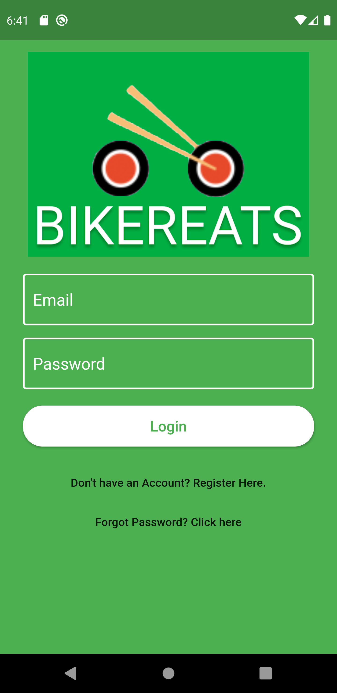
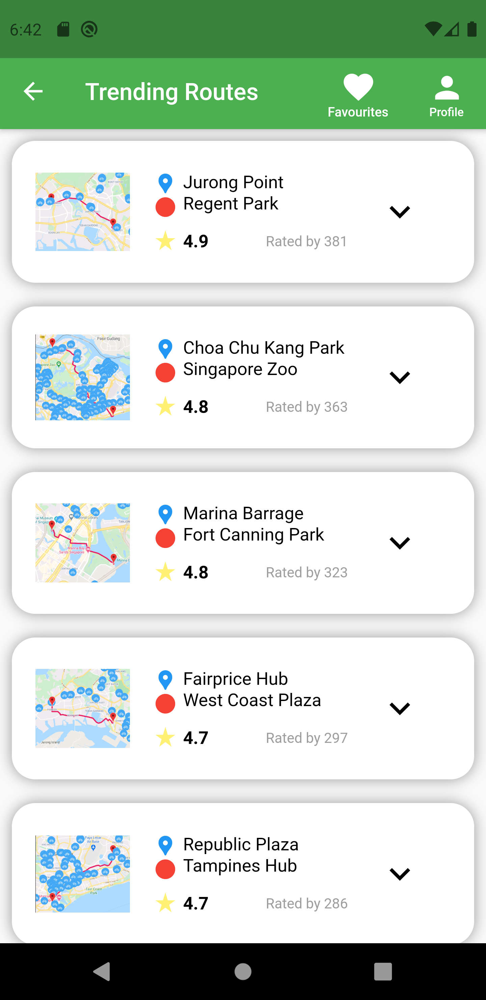
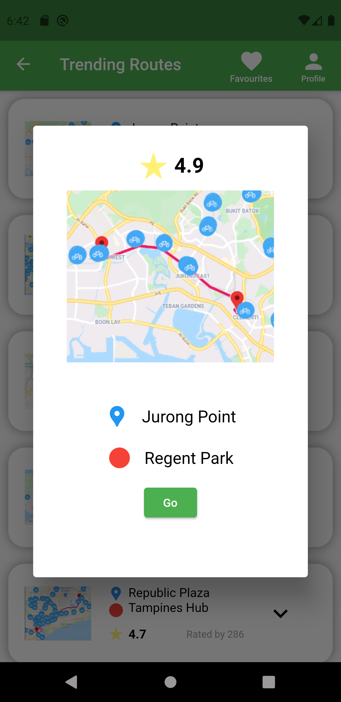
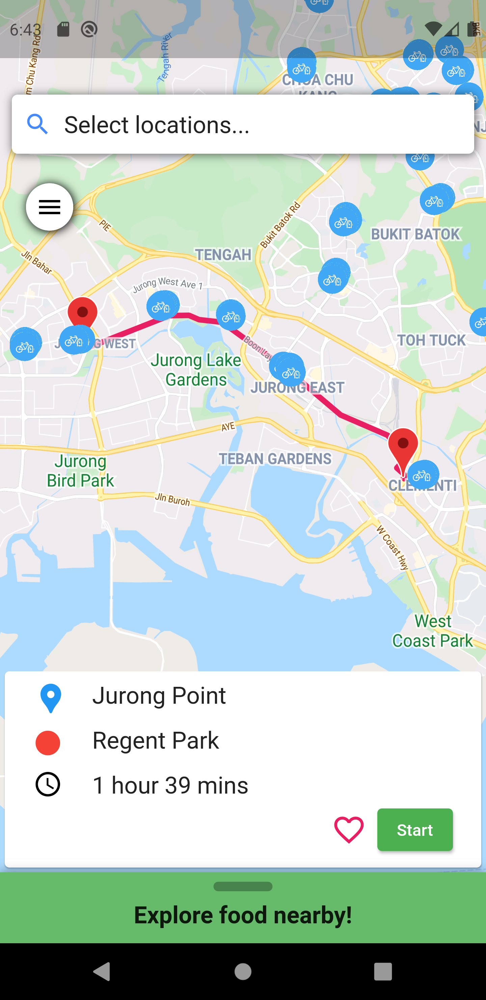

# bikereats

Bikereats is a mobile application which allows cyclists to plan their routes based on the availability of cycling racks in Singapore. The application considers a user's “workflow” and presents the relevant information timely. When the user chooses a cycling journey, bicycle racks are displayed and weather forecast will be provided. Food places near the end of the journey will also be shown as people tend to get hungry after a workout!

Done in collaboration with Min, Liang Yi, Carissa, Shannon and Alicia.

*Note: Google Maps API no longer maintained after expiry of free trial. Include your own API key to continue using.

## Example
    

## Getting Started

This project is a starting point for a Flutter application.

A few resources to get you started if this is your first Flutter project:

- [Lab: Write your first Flutter app](https://flutter.dev/docs/get-started/codelab)
- [Cookbook: Useful Flutter samples](https://flutter.dev/docs/cookbook)

For help getting started with Flutter, view our
[online documentation](https://flutter.dev/docs), which offers tutorials,
samples, guidance on mobile development, and a full API reference.
